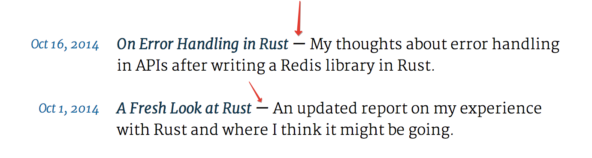

Лекция 1. HTML и CSS
===================

[Скринкаст первой части лекции](http://www.youtube.com/watch?v=cIwvT-RQ6Ss)

Скринкаст второй части лекции в этот раз записать не удалось.

Введение
--------

Дальше мы будем писать скринкасты, поэтому если вы сейчас что-то упустите или если ваши друзья сегодня не пришли, то, возможно, они всё наверстают.

Представлюсь. Меня зовут Виталий Павленко, я учусь на пятом курсе ФИВТа, на первом году магистратуры в Сколтехе, и ещё учусь в ШАДе. Я стажировался в Гугле и в Интеле.

О чём будет курс. Я покажу, что я сам руками делал, поэтому представляю, как оно работает. Примерно до уровня этих проектов мы сумеем за полтора семестра дойти. 

[Этот сайт - учебник по Питону.](http://pythontutor.ru/) Тут есть уроки, уроки имеют текст и код, причём этот код можно выполнять. Этот питоновский код реально выполняется так: он отдаётся на сторону сервера, дальше он там выполняется, все кадры исполнения записываются в отладочном режиме. Дальше они передаются на клиента, и на клиенте они умеют отрисовываться. Далее, здесь есть задачки. Можно писать решения задач, можно их тестировать на тестах. Со временем сайт оброс разными штуками. Например, тут есть система комментариев. Или например, [Владимир Соломатин](https://vk.com/leenr) прикрутил вход через социальные сети, как это сейчас модно.

Это сайт, который имеет логику на клиенте и производит хитрые действия на сервере: поддерживается база пользователей, про пользователей мы запоминаем, какие задачи они решали, какие коды они сдавали, какие статусы проверки они при этом получали. Эти данные мы при необходимости показываем, по ним мы можем считать статистику.

На самом деле, этот сайт не целиком написан мной. Когда я его писал, я начинал с [визуализатора Питона](http://pythontutor.com/). Это сайт, который умеет визуализировать исполнение питоновского кода. Если туда ввести код, то он умеет показывать исполнение кода по шагам и показывать, что при этом происходит с объектами в памяти. Я эту часть скопировал, поскольку она распространяется по свободной лицензии, и попытался написать вокруг неё на фреймворке Джанго, который я к тому моменту знал, систему проверки задач и систему регистрации пользователей, чтобы визуализатор был встроен в учебник языка программирования. Логику всю вокруг я писал сам, а логику визуализации я копировал. Сейчас она частично взята из другого места и переписана, но я всё ещё в целом понимаю, что в ней происходит.

Есть более простой сайт. Мы делали [проект на инновационном практикуме](http://2long2read.ru/). Идея проекта была такая: мы думали, что есть такие пользователи, которые часто читают длинные тексты, и при этом они не хотят всегда тратить время на чтение очень длинного текста целиком. Поэтому если мы научимся выделять главное в тексте, подкрашивать его жёлтым и давать пользователям возможность сначала прочитать главное, а потом, по мере того, как текст им становится интересным, помогать им читать ещё предложения. Или же помогать им быстро понять, что этот текст им не интересен. 

Выделение главного в текстах - это большая область в машинном обучении, по ней написаны статьи, и мы решили, что мы просто заимплементим алгоритмы, вокруг этого сделаем веб-морду, поднимем сервер, который будет запускать эти алгоритмы, отдавать пользователю ответ и красить текст. Ещё у сервиса есть [API](http://2long2read.ru/ru/api_description/), т. е. сторонние сайты могут коннектиться к нам, отдавать нам данные в формате JSON и получать на выходе размеченный текст, чтобы использовать у себя на сайте. Например, нам писали админы одного сайта с рефератами, которые хотели выделять в рефератах главное, чтобы показывать его в превьюшке.

Обвязка сервиса - веб-часть, та часть, которая не связана с алгоритмами, которые крутятся на сервер - это то, что я писал и понимаю. То, что происходит у нас на клиенте - эту версию клиентской части писал не я, а другой человек, но я следил за ним и примерно понимаю, что у нас там написано.

Вот на такого уровня вещи мы будем ориентироваться. Я вас прошу думать, где вы можете применить знания, которые вы можете у нас получить, и что вы можете сами для себя закодить. Если вы освоите веб-программирование, то дальше вы можете сделать что угодно. Вы можете написать свою социальную сеть, если вам покажется, что какой-то социальной сети в мире ещё нет. Вы можете сделать портал, который позволяет быстро клепать демотиваторы и быстро ими обмениваться. Такие порталы, конечно же, существуют, но если вы придумаете, портала с какой ключевой фишкой ещё не существует, то вы можете закодить его самостоятельно. Если вам придёт ещё какая-то идея, то после нашего курса вы сможете написать для неё веб-морду, серьёзную серверную логику. Мы попробуем этому научить.

Я думаю, что знаний для того, чтобы начинать писать, у вас будет хватать через два месяца.

Технологии на вебе
-----------------

Какие на вебе вообще есть технологии? На стороне браузера, то, что всегда видно людям, набор очень ограничен. Всё делается на трёх языках: HTML, CSS и JavaScript, причём каждый делает свое: 
- HTML распологает элементы
- CSS настраивает их стили, то, как они выглядят, уточняет расположение элементов, шрифты, отступы
- JavaScript накручивает логику, которая позволяет динамически менять содержимое, делать запросы к серверу, получаь ответ и создавать какие-то теги

Так устоялось, что на вебе используются эти технологии. Лет 20-25 назад на вебе было примерно то же самое. Так случилось, что новые языки браузеры особо не поддерживают. Они поддерживают улучшенные версии этих языков. Например, недавно появился стандарт HTML5, в котором добавились разные теги, появился стандарт CSS3, в котором тоже добавили функциональности. Но на клиентской части ни с чем другим работать не получится: бразуер пользователя умеет воспринимать и интерпретировать только эти языки.

За первое занятие сегодня мы поговорим про HTML и CSS - это вёрстка, т. е. как сайт выглядит. Мы в общих чертах поймем, как что-то верстать. Вёрстка - это сложная тема, и я не смогу её рассказать в деталях, хотя бы потому что я сам очень плохо верстаю. Но нам это не нужно. Нам нужно понять, что вообще происходит в мире, и научиться решать наши задачи хотя бы одним способом. Есть такой способ, называется CSS-фреймворки: это когда вы говорите: я программист, я не верстальщик, я возьму готовую библиотеку, там уже есть красивые кнопочки и разметка. И пусть мой сайт будет выглядеть так же, как и остальные сайты, использующие эту библиотеку, но зато это будет работать.

На следующем занятии мы поговорим про JavaScript. Мы научимся анимировать то, что происходит на клиенте.

А дальше мы будем разбираться с тем, что происходит на сервере. А на сервере может происходить уже всё, что вы захотите, потому что с браузером вы общаетесь по специфицированному протоколоу - HTTP. Протокол специфицирует, какие текстовые данные вы передаете, если браузер коннектится к конкретному сокету на удалённом сервере. Но какая программа сидит на сервере и общается по этому сокету, на каком языке написана эта программа - это решать целиком вам. Поэтому серверную логику можно писать вообще на всех языках, из которых доступны сокеты. Просто на некоторых языках доступно огромное количество библиотек, которые упрощают это занятие. Вы можете найти библиотеки под Паскаль, которые реализуют протокол HTTP, и писать серверную логику на нём. А даже если под язык есть сокеты, но нет библиотек, реализующих HTTP (Фортран?), то вы всё равно можете реализовать протокол HTTP и начать писать на них веб-приложения.

Если вы начнёте смотреть на языки, для которых существует много веб-фреймворков и много инфраструктуры для упрощения работы программистов, то окажется, что таких языков очень много, и мир делится на очень много категорий. Некоторые люди пишут на стейке Майкрософта: ASP.NET, на языке C#. Некоторые люди пишут серверную логику на Джаве, причём по-разному. Мы будем писать на Питоне, потому что, во-первых, язык довольно популярный сейчас, а во-вторых, я довольно хорошо разбираюсь в питоновском фреймворке Джанго. Джанго - большой фреймворк, поэтому если вы его освоите, то вы сможете решать свои проблемы с его помощью очень легко: в нём уже много функционала встроено. Другие фреймворки бывают меньше по объёму, и вам иногда не хватает их мощи, и приходится добирать функционал сторонними библиотеками.

То, что находится на сервере, мы будем называть бекендом. То, что крутится на клиенте, мы будем называть фронтендом. Люди пишут бекенд на чём угодно: например, пишут на Джаваскрипте: есть такой фреймворк Node.js. Хотя он больше популярен на западе: среди моих знакомых на Node.js никто не пишут. Люди пишут на PHP и на Питоне.

Из всех этих технологий мы выбрали Питон и будем осматривать два фреймворка: простой фреймворк Flask, чтобы начинать с простых вещей, и фреймворк Django, который мы посмотрим очень подробно. Когда мы его освоим, то у вас появится впечатление, что вы можете реализовать то, что хотите.

Сайт курса - это [этот репозиторий](https://github.com/vpavlenko/web-programming).


HTML, CSS и JavaScript
------------------

Давайте я сначала за три минуты объясню, что такое HTML, CSS и JavaScript, и что они делают. Мы посмотрим [очень простой пример](http://vpavlenko.github.io/web-programming/01-html-css/three-boxes-single-file.html). Он мало похож на сайты, которые вы видели, но он всё равно исполняется в браузере. Что здесь происходит: если кликать по квадратам, то они меняют свой цвет: с красного на синий и обратно.

В браузере вы всегда можете посмотреть исходный код страничке - правый клик мыши, "Просмотр исходного кода". Весь код этого примера помещается в один файл длиной в 38 строчек, в нём содержится код на трёх языках:
```html
<html>
    <head>
        <style type="text/css">
            .wrapper {
                background: pink;
            }

            .rect {
                width: 50px;
                height: 50px;
                margin-bottom: 20px;
                background: black;
            }       
        </style>
    </head>
    <body>
        <div class="wrapper">
            <div class="rect"></div>
            <div class="rect"></div>
            <div class="rect"></div>
        </div>

        <script type="text/javascript">
            function toggleYellow() {
                if (this.style.background == "blue") {
                    this.style.background = "red";
                } else {
                    this.style.background = "blue";
                }
            }

            var rects = document.getElementsByClassName("rect");
            for (var i in rects) {
                rects[i].addEventListener("click", toggleYellow);   
            }
        </script>
    </body>
</html>
```

Текст на языке HTML состоит из тегов. HTML - это не язык программирования, это язык разметки. Исходная идея интернета была в следующем: мы просто будем делать набор текстовых документов, которые будем соединять между собой ссылками. Для ссылок тоже есть свой тег. Например, чтобы поставить ссылку на сайт Гугла, мы пишем
```html
<a href="http://google.com/">Сайт Гугла</a>
```

Тег записывается в угловые скобки. Он имеет название (в примере - `a`), и дальше тег имеет список атрибутов, которые записываются как `ключ="значение"`. Внутри тега может быть текст, могут быть вложены другие теги. Тег закрывается через слэш-название: `</a>`. Тег меняет свойства того, что записано внутри него.

Для просмотра свойств содержимого страницы в браузерах предусмотрены "Инструменты разработчика".

Тег `<div>` - это просто коробка, которой можно задать произвольный размер, границы, стили, цвета. Современная вёрстка - это набор дивов, которые друг относительно друга расположены, им присвоена некоторая ширина, в них накладывается содержимое, и оно показывается пользователю. Расположение дивов ещё можно менять в зависимости от того, мобильное устройство у пользователя, или же компьютер.

В примере с тремя квадратиками `<div class="wrapper">` - это розовая коробка, а `<div class="rect">` - это чёрный квадратик, у которого есть есть отступ снизу.

Таким образом, вот это - код на языке HTML:
```html
<div class="wrapper">
    <div class="rect"></div>
    <div class="rect"></div>
    <div class="rect"></div>
</div>
```

А вот код на CSS, который определяет, как будут выглядеть эти элементы:
```css
.wrapper {
    background: pink;
}

.rect {
    width: 50px;
    height: 50px;
    margin-bottom: 20px;
    background: black;
}
```

Например, правило 
```css
.wrapper {
    background: pink;
}
```
означает, что у объемлющей коробки будет розовый фон.

Каждому тегу с классом `rect` присваивается высота, ширина, отступ снизу и исходный цвет. Все CSS-правила выглядят так:
```text
селектор1, селектор2 {
    свойство1: значение1;
    свойство2: значение2;
}
```

С помощью инструментов разработчика можно моментально менять CSS-свойства тегов и селекторов и смотреть, что при этом будет происходить.

Весь документ имеет такую структуру:
```html
<html>
    <head>
        стили, заголовок, метаинформация
    </head>
    <body>
        содержимое
    </body>
</html>
```

Наконец, логика смены цвета по клику написана на языке Джаваскрипт:
```js
function toggleYellow() {
    if (this.style.background == "blue") {
        this.style.background = "red";
    } else {
        this.style.background = "blue";
    }
}

var rects = document.getElementsByClassName("rect");
for (var i in rects) {
    rects[i].addEventListener("click", toggleYellow);   
}
```

Вот так мы находим все прямоугольники на странице, используя тот факт, что у всех тегов с прямоугольниками стоит придуманный нами класс `rect`:
```js
var rects = document.getElementsByClassName("rect");
```

Джаваскрипт - это полноценный динамический язык программирования. В нём не нужно объявлять типы переменных. В нём есть числа, строки, списки (расширяющиеся массивы), словари (хэш-таблицы, мапы), циклы, условия, функции. Про это подробно мы поговорим в следующий раз.

В коде мы получаем массив элементов, кладём его в переменную `rects`, проходимся по нему циклом и добавляем каждому тегу обработчик события "click" - функцию `toggleYellow`. Она так называется, потому что неделю назад в примере цвет менялся с чёрного на желтый, а не с синего на красный :)

Посмотрим, что происходит внутри функции-обработчика. Переменная `this` хранит ровно тот объект-тег, на котором произошло событие. Мы работаем с CSS-свойством `background` подобъекта `style` этого тега.

Необязательно весь код хранить в одном файле. [Вот тот же пример с тремя разными файлами](http://vpavlenko.github.io/web-programming/01-html-css/three-boxes/), [вот он в репозитории](three-boxes).

Файлы со стилями подключаются так:
```html
<link rel="stylesheet" type="text/css" href="style.css">
```

Файлы со скриптами подключаются так:
```html
<script type="text/javascript" src="main.js"></script>
```

Некоторые люди добавляют скрипты в тег `<head></head>`, до содержимого страницы. В языках клиентской части можно допускать много вольностей в синтаксисе. В частности, CSS-вставку вы можете перенести в самое начало документа - ничего не изменится. Если вы не напишете теги `<html>`, `<head>` и `<body>`, то от этого тоже ничего не изменитя. Последние браузеры будут показывать это нормально. [Гугловый стайл-гайд советует их опускать](https://google-styleguide.googlecode.com/svn/trunk/htmlcssguide.xml?showone=Optional_Tags#Optional_Tags).

При этом декларацию `<script></script>` в нашем примере нельзя переместить до тегов `<div>`, иначе клики перестанут работать. Это происходит потому, что скрипт, вставленный на страницу, начинает выполняться сразу же, до момента, когда HTML-код страницы будет целиком обработан, и до того, как дерево тегов `<div>` будет построено. Поэтому функция `document.getElementsByClassName("rect")` вернет пустой список, и обработчики кликов ни на что не навесятся.


HTML двадцатилетней давности
----------------

Давайте посмотрим на домашнюю страничку [Гвидо ван Россума](https://www.python.org/~guido/). Исходно веб задумывался для таких документов, где люди умеют добавлять текст, заголовки, вставлять картинки, списки, ставить ссылки. Всё то же самое можно делать и в Ворде.

Код страницы начинается так:
```html
<HTML>

<HEAD>
<TITLE>Guido's Personal Home Page</TITLE>
</HEAD>

<BODY BGCOLOR="#FFFFFF" TEXT="#000000">

<H1>
<a href="pics.html"></a>
Guido van Rossum - Personal Home Page</H1>
```

Видно, что язык HTML устойчив к отступам, к регистру в названиях тегов.

Что есть в этом документе? Тег `<h1>` обрамляет заголовок верхнего уровня, т. е. самый большой. Картинка вставляется тегом ``. У этого тега много атрибутов. Все их можно найти [в каком-нибудь справочнике](http://htmlbook.ru/html/img). Самый важный атрибут - это `src`, который задаёт, с какого адреса надо грузить картинку. Локальный путь `images/IMG_2192.jpg` отсчитывается от папки текущей страницы: `https://www.python.org/~guido/`. Всё это обрамляется в тег `<a>`, так что картинка является ссылкой.

Вся эта страница - это просто английский текст, некоторые части которого обрамлены тегами.

Некоторые теги надо закрывать, например тег `<a>`. Его границы определяют, какая часть содержимого будет ссылкой. Напротив, тег `` закрывать необязательно.

```html
<P><b>Pronunciation:</b> in Dutch, the "G" in Guido is a hard G,
pronounced roughly like the "ch" in Scottish "loch".
```

Тег `<b>` обрамляет жирный текст. Обычно названия тегов - это понятные сокращения: `b` - это сохранение от `bold`.

Списки имеют такую структуру:
```html
<ul> <!-- Это сокращение от Unordered List -->
  <li>Элемент списка <!-- List Item -->
  <li>Ещё элемент списка
</ul>
```

Ещё стоит знать, как верстаются [формы](http://jsfiddle.net/ZJcX2/2/) и [таблицы](http://jsfiddle.net/b6R9R/1/). [Подробности в скринкасте.](http://youtu.be/cIwvT-RQ6Ss?t=32m45s)

[JsFiddle](http://jsfiddle.net/) - это сайт, который позволяет легко делиться примерами кода на клиентских языках. Примеры можно сохранять кнопками Save/Update.


Современный HTML, CSS
--------------

[Блог Армина Ронахера](http://lucumr.pocoo.org/) - это пример современного подхода к вёрстке. Здесь всё свёрстано на дивах.

Первое, что стоит понять про дивы - это блочная модель. У каждого дива (и вообще у каждого блочного элемента) есть свойства margin, border и padding: внешние отступы от элемента до других дивов, размер и форма границы, а также внутренний отступ от границы до содержимого:


С помощью CSS можно управлять этими атрибутами. На странице блога дивы заголовка и навигации `<div class=header>` и `<div class=navigation>` имеют свойство
```css
div.header, div.navigation  { height: 25px; margin-bottom: 42px; }
```
Это добавляет им отступ снизу, отделяя от основного содержимого.

Объясним пару сложных примеров из CSS-кода блога.

Вот так можно подгрузить на страницу дополнительный шрифт:
```css
@import url(http://fonts.googleapis.com/css?family=Merriweather:400,700,400italic,700italic,300,300italic&subset=latin,latin-ext);
```

С помощью псевдокласса `:hover` можно переписать дефолтный цвет ссылок, на которые наведена мышка:
```css
a:hover { color: #14A5E3; }
```
Цвет задается в формате RGB тремя шестнадцатеричными числами (от 00 до FF).

Разберем такую строчку:
```css
div.entry-overview h1:after         { content: " —"; color: black; }
```
Селектор выбирает все заголовки `<h1>`, которые лежат где-то внутри дивов с классом `entry-overview`. После них (`:after`) дописывается тире (`content: " —"`). Так с помощью CSS проставляется разделитель заголовка и описания статьи:


Все виды селекторов можно найти [в справках](http://www.w3schools.com/cssref/css_selectors.asp).


Флоаты и сложная вёрстка
-------------

Поскольку исходно язык HTML не был предназначен для сложной вёрстки, то при использовании дивов даже в простых задачах возникают сложные проблемы, которые приходится решать сомнительными трюками. Например, по умолчанию два дива, стоящих подряд, располагаются один под другим. Так делают все блочные элементы в HTML. Однако часто нужно расположить два дива на одной линии: как дивы `header` и `navigation` в блоге. Для этого в блоге используется CSS-свойство `float`:
```css
div.header                  { float: left; }
div.navigation              { float: right; }
```

Если вы начнёте делать две колонки с помощью этого свойства, вы легко можете столкнуться с проблемами. Дело в том, что исходное предназначение свойства `float` - дать возможность вставлять в текст картинки, которые будут обтекаться текстом:


Поэтому поведение свойства не идеально заточено под многоколонную вёрстку и прочие случаи, когда флоат хочется использовать. Подробности можно увидеть [в упражнениях на htmlacademy](htmlacademy.ru/courses/65/run/8).

Вообще, вёрстка - это процесс умелого комбинирования костылей, сделанных из CSS-свойств, которые исходно не были разработаны для вёрстки. Масштаб изобретательности верстальщиков можно оценить [по этой статье про трёхколоночный макет](http://htmlbook.ru/samlayout/tipovye-makety/rezinovyi-trekhkolonochnyi-maket). С течением времени веб-инструменты медленно эволюционируют. Например, только недавно [все популярные браузеры начали поддерживать свойство `flexbox`](http://caniuse.com/#search=flexbox), специально предназначенное для сложной вёрстки.

Пара демонстраций хаков, позволяющих добиться нетривиального поведения дивов:
- [див фиксированной ширины, выровненный по центру относительно родителя](http://learnlayout.com/margin-auto.html)
- [две колонки не через флоаты и фиксированный подвал (footer)](http://learnlayout.com/position-example.html)

Мало того, что раньше стандарты имели недостаточно свойств для комфортной вёрстки. Некоторые браузеры плохо поддерживали существующие стандарты. Особенно этим славился Internet explorer. В качестве исторического анекдота, советую посмотреть [получасовую лекцию](http://www.artlebedev.ru/tools/technogrette/html/rounded-corners/) шестилетней давности про способы создания скругленных уголков в браузере, который не поддерживал свойство border-radius.


Про генерируемое содержимое
-------------

Страницы на вебе можно разделить на написанные целиком руками и генерируемые. Например, страница Гвидо ван Россума наверняка вручную целиком поддерживается им самим. Напротив, страницы блога Армина Ронахера автоматически генерируются сервером. А именно, на сервере имеется база данных, в которой хранятся все записи блога. Если пользователь запрашивает третью страницу записей, то сервер запрашивает у базы все записи с 21 по 30, после чего 10 раз заполняет шаблон для одной записи данными из базы. 

Так выглядит одна запись:
```html
    <div class=entry-overview>
      <div class=date>Aug 24, 2014</div>
      <div class=detail>
        <h1><a href="/2014/8/24/revenge-of-the-types">Revenge of the Types</a></h1>
        
        <div class=summary><p>Some notes about what appears to be current trend of programming
languages and my thoughts about it.</p>
</div>
        
      </div>
    </div>
```

Шаблон для неё [выглядит так](https://github.com/mitsuhiko/rstblog/blob/master/rstblog/templates/blog/index.html):
```html
  <div class=entry-overview>
    <div class=date>{{ format_date(entry.pub_date, format='medium') }}</div>
    <div class=detail>
      <h1><a href="{{ link_to('page', slug=entry.slug) }}">{{ entry.title }}</a></h1>
      
      <div class=summary>{{ entry.render_summary() }}</div>
      
    </div>
  </div>
```

Предыдущий абзац - неправда. Насколько я понимаю, раньше блог действительно был динамическим и вёл себя так, как я описал. Однако ясно, что необязательно отрисовывать третью страницу записей каждый раз заново, если она меняется только примерно пару раз в месяц, при добавлении новой записи в блог. Поэтому сейчас блог - [статический](https://github.com/mitsuhiko/rstblog).


Про CSS-фреймворки
