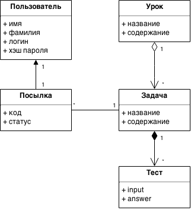
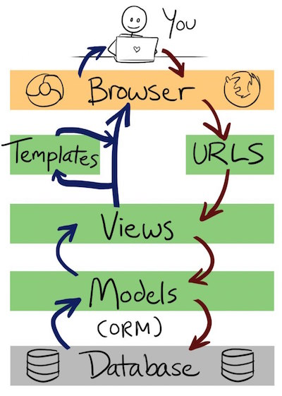

Django - 1
======================

План лекции
-------

1. Метод Аббота. UML-диаграмма классов.
2. Язык SQL. База данных sqlite3, [работа с базой sqlite3 из языка Python](sqlite_examples).
3. Фреймворк Django: создание пустого приложения.
4. Концепции: apps, urls, views, templates.
5. Models: Django ORM.
6. Интерфейс администратора базы.

Описание тестирующей системы
------

Пользователь заходит в систему видит набор Уроков. Каждый Урок содержит теорию и набор Задач. Каждая Задача имеет свою страницу, на которой показывается условие Задачи, формат входных и выходных данных. Пользователь может отправить Посылку по задаче. При этом Посылка будет протестирована на наборе Тестов. Если она выдаст правильные ответы на всех Тестах, то получит статус "верно", а иначе - статус "неверно". Все посылки видны пользователю на странице Задачи.



Как создать Django-проект
---

Используйте [официальный туториал](https://docs.djangoproject.com/en/1.7/intro/tutorial01/).

Возможно, вам понадобятся какие-то хаки при установке или настройке. Например, на Mac OS X я делал так:
```
sudo /opt/local/bin/pip-3.3 install -U django
alias python3="/opt/local/bin/python3.3"
alias django-admin.py="python3 /opt/local/Library/Frameworks/Python.framework/Versions/3.3/lib/python3.3/site-packages/django/bin/django-admin.py"
```

Какие команды из туториала я выполнял в начале работы:
```
django-admin.py startproject testingplatform
python3 manage.py migrate
python3 manage.py runserver
python3 manage.py startapp lessons
# ...
# Some changes to to lessons/models.py
# ...
python3 manage.py makemigrations
python3 manage.py check
python3 manage.py migrate
python3 manage.py createsuperuser
```

Мой результат лежит [в репозитории](testingplatform).

Как работает Джанго
---




Задание
------

Выберите проект, на котором вы будете играться с технологиями в этом семестре. Примеры проектов:
- социальная сеть
- мессенджер
- блог-платформа
- интернет-магазин
- система для проведения онлайн-курсов

1. Напишите описание функционала вашего проекта (абзац текста). Сущности выделяйте большой буквой для наглядности.
2. Нарисуйте UML-диаграмму классов вашего проекта в [draw.io](https://drive.draw.io/). Слева ищите блок инструментов UML. Экспортируйте диаграмму в какой-нибудь формат.
3. Создайте Django-приложение с несколькими страницами. Реализуйте минимальный функционал вашего проекта.
4. Выложите это как гит-репозиторий и добавьте ссылку на [вики-страницу для решений](https://github.com/vpavlenko/web-programming/wiki/%D0%A0%D0%B5%D1%88%D0%B5%D0%BD%D0%B8%D1%8F-%D0%B7%D0%B0%D0%B4%D0%B0%D0%BD%D0%B8%D0%B9-%D0%B7%D0%B0%D0%BD%D1%8F%D1%82%D0%B8%D1%8F-7:-Django-1).


Материалы
---

1. The Django Book: [оригинал](http://www.djangobook.com/en/2.0/index.html), [перевод](http://djbook.ru/rel1.7/)
2. Пример большого проекта на Джанге: [блог-платформа pybbm](https://github.com/hovel/pybbm)
